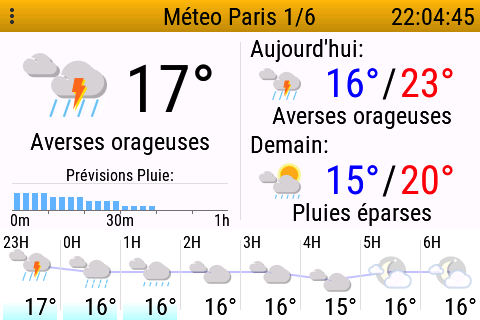
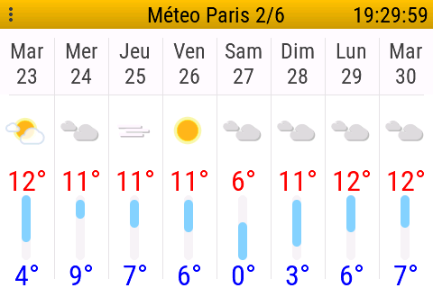
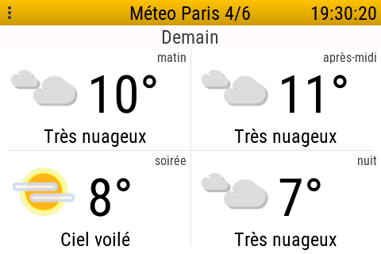

# openHASP_meteofrance

French weather reports on openHASP, independent from Home Assistant.

It is made for a 480 x 320 display, in landscape mode.

It is comprised of:

* a section of pages.jsonl: ```files/pages_section.jsonl```
* images files: ```files/p*.bin```
* a python script that feeds the openHASP plate via MQTT, and is to be run every x minutes: ```send_weather.py```. It will replace all weather data on each pass.

# Provided pages

The weather info will be shown on the following pages:

* main page: weather now, overal today, overall tomorrow, rain in next hour, and weather for the next 8 hours:
  
  

* week overview page: overall info for the next 8 days:
  
  

* N pages, 1 per day, each with quarter-day overview (N = configurable via NR_DAYS_DETAIL in the ```send_weather.py``` file):
  
  

The pages must be consecutive, and in that order. If you change the page numbers, you must also adapt the setting START_PAGE in the ```send_weather.py``` file.

# The feed script 

See ```send_weather.py```.

It is to be run regularly (by cron for example). The following is required:

* python 3
* python lib dependencies:

```bash
python3 -m pip install meteofrance-api
python3 -m pip install paho-mqtt
```

See the variable at the top of the file for configurables, the most important being:

```python
MQTTSERVER = "192.168.4.20"
CITY = "Paris"
PLATE_NAME = "plate01"
START_PAGE = 2
NR_DAYS_DETAIL = 4
```

If you change CITY, START_PAGE or NR_DAYS_DETAIL, you will of course need to adapt the contents of the jsonl.

# How to get new images

* get the SVG files from meteofrance via ```python3 svg2png.py```
* then transform the ```img/p*.png``` files to bin files:
  * I did that on line, following the indications on ther openHASP site. Just be aware that the online tool can only handle about 12 files at a time.
  * put the resulting bin files in /files
  * upload the bin files to the device

